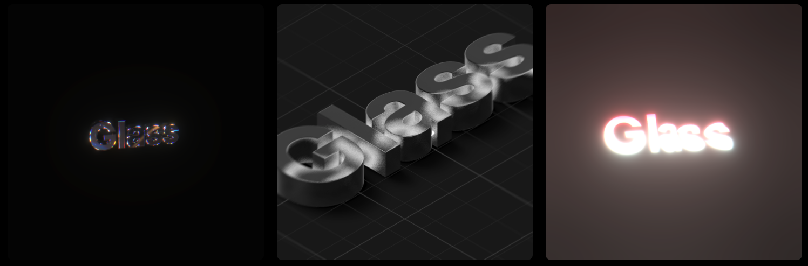

<h1 align='center'>✨ glass</h1>

A collection of 3D text effects

<a href="https://glass.fleet.im/">Visit Website</a> · <a href="https://github.com/DipokalLab/glass/issues">Report Bugs</a>

## About

A collection of 3D text effects ready for immediate use on the web. Easily output as images. Built with Three.js.

Customize text to your liking and export it as an image. Enter your own custom text to download the generated image.

> [!NOTE]
> 📢 <strong>This project is actively maintained and continuously updated.</strong> We are constantly adding new text effects to expand support.

## Roadmap

- [x] Create Image
- [x] Text Option
- [ ] Create Video
- [ ] Add Animation Effects
- [ ] Intro Preset
- [ ] Add More Text

## Contributors

Hyeong Jun Huh [(GitHub)](https://github.com/DipokalLab)

## License

MIT License
